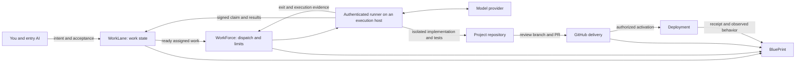
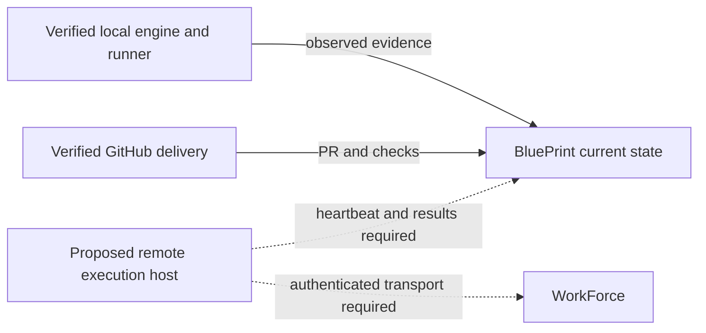

# BluePrint over AI work

BluePrint is the umbrella operations interface. It brings work, projects, agents, activity and connections together while the owning engines and projects retain their responsibilities. Connecting a model provider does not by itself create an agent that can claim, test, deliver or deploy work.

## Implementation contract

The arrows describe a complete contract, not a claim that every connection is installed. Verify each arrow in the selected workspace. WorkLane owns task writes; WorkForce owns execution. Projects own their business functions and data. A reporting job can provide useful observations without being an implementation worker.

## Provider, runner and host

| Component | Meaning | Evidence needed |
|---|---|---|
| Model provider | Supplies model inference | Account authentication and a successful request |
| Agent runner | Runs the tool loop, reads instructions and acts on work | Dedicated identity, allowed tools, scope, limits, signed claim and results |
| Execution host | Machine where tools and checkout run | Host identity, isolated checkout, process/run evidence |
| GitHub connection | Repository review and delivery | Verified repository, PR/check/merge state |
| Deployment | Installed application and configuration | Build identity, activation receipt, observed behavior |

A local CLI calling a hosted model is local execution. It can be manually dispatched or scheduled. A remote execution host additionally requires authenticated transport, scoped credentials, a work/claim bridge, liveness reporting and durable result delivery. GitHub connectivity alone supplies none of those runtime guarantees.

## Current versus proposed connections

The current connection view must describe observed state per source: configured, authenticated, running, idle, stale, unavailable or unverified. Keep the workspace's actual providers and run receipts in its local operating guide, outside public product source.

Solid links represent connections only after they are verified in that workspace. Dashed links are proposed and must remain visibly unconfigured until demonstrated. Do not substitute a provider logo, old agent name, successful report or commit timestamp for execution evidence.

## Proving a first worker

Start with one bounded work order and a manual worker. Pin its identity and project queue, verify authentication, isolate its checkout, state allowed writes and delivery permissions, and configure time/fault/empty exits. Verify the signed claim, meaningful code change, tests, reviewed PR and result record. Verify deployment separately. Only then expand recurring work, providers or hosts.

[Operating process](../specs/ALWAYS_WORK_PROCESS.md) · [Deployment](DEPLOYMENT.md)
